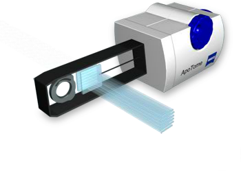
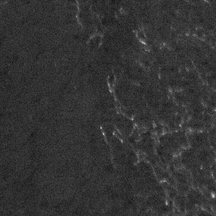
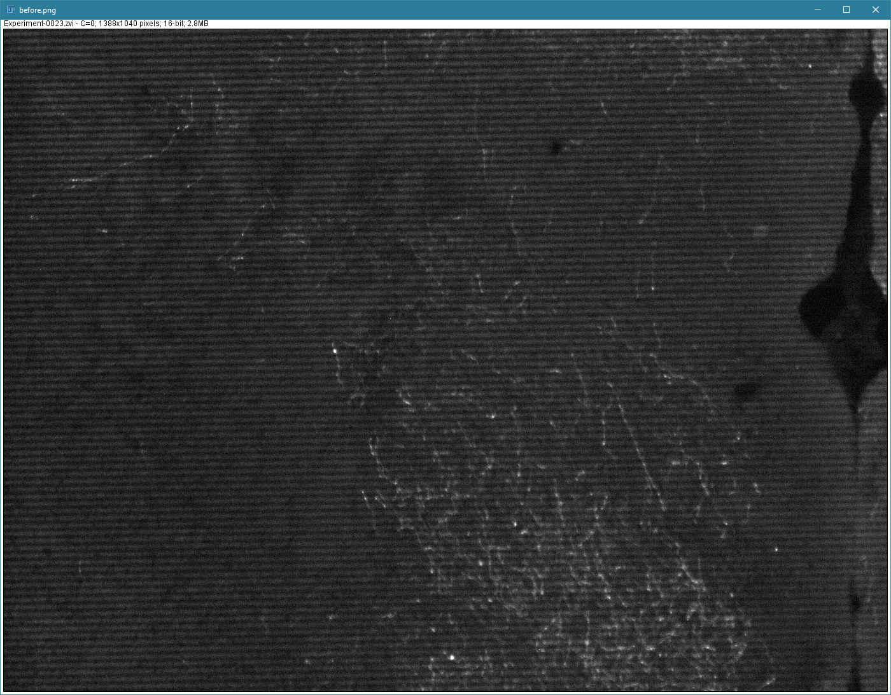
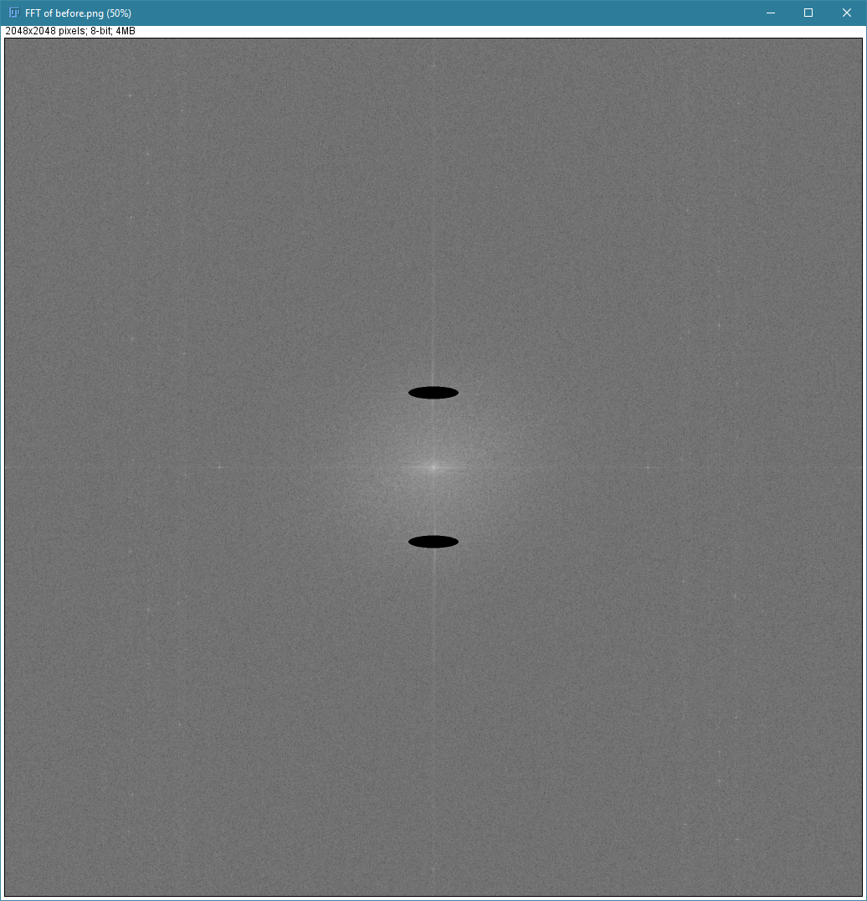

The [Zeiss ApoTome](http://zeiss-campus.magnet.fsu.edu/tutorials/opticalsectioning/apotome/indexflash.html) is an optical instrument which can be placed in the light path of a traditional epifluorescence microscope to reduce out-of-focus light and enhance optional sectioning. This is achieved by illuminating the specimen through a rapidly tilting a glass plate with a grid on it and analyzing the resulting image in real time to create an image which maximally excites and captures light at a single optical section (calculated from at least 3 raw images acquired at different tilt angles).

<div class="text-center">
    
    
</div>

A poorly-calibrated ApoTome will produce imaging artifacts which appear as horizontal lines on the final image (in addition to increased collection of out-of-focus light). The ApoTome must be calibrated separately for every filter cube / lens combination. An ApoTome on a microscope with 4 filter cubes and 5 lenses must be calibrated 20 times. Calibration is a two-step process, requiring phase calibration and a grid calibration. See [Imaging Associates - ApoTome Calibration Guide](http://www.usask.ca/biology/scopes/ApoTome%20Takeoff%20Guide%20%28calibration%29.pdf).

Although ApoTome artifact lines can be reduced by improving calibration, images with these artifacts can be improved with ImageJ. Since the artifacts are typically horizontal lines with a regular distance between them, they are ideally isolated (and eliminated) in the frequency domain. The conversion of linear data into a frequency domain can be accomplished using the [Fast Fourier transform](https://en.wikipedia.org/wiki/Fast_Fourier_transform) (FFT), and this has [special uses for image processing when a 2D FFT is used](http://www.robots.ox.ac.uk/~az/lectures/ia/lect2.pdf). In our case we will convert the artifact-laden image to the frequency domain, identify the frequencies underlying the artifact, and perform an inverse FFT (iFFT) to create an original image with reduced artifacts.

<div class="text-center">

### Image with ApoTome artifacts 
 

### Same image corrected with ImageJ


</div>

## Manual Reduction of ApoTome Artifacts

- Open an image with ApoTome artifacts
- Create an FFT (Process > FFT > FFT)
- Select black color (double click the dropper tool)
- Identify apotome artifact hot spots
  - Hot spots appear as bright points of light (excluding the center point)
  - Apotome artifact hot spits will be symmetrical on both sides of the center point
  - If apotome lines are horizontal, the artifacts will be bright points along the horizontal mid-line of the image vertically offset from the center.
  - If the apotome is rotationally misaligned, it will deviate from midline by the same angle of its misalignment.
  - Most FFTs from apotome images have 2 hot spots, but its possible more than 2 are needed.
- Select the hot spots with the elipse tool
- Fill each hot spot with dark (CTRL+F)
- Create an inverse FFT (Process > FFT > Inverse FFT)

<div class="text-center">

### Original


### FFT


### FFT with blanks


### Inverse FFT


</div>

## Automatic Reduction of ApoTome Artifacts

Manual reduction of ApoTome artifacts using the above method is labor-intense. If you have a stack with a large number of images, this process can be applied to every slice of the stack using the following ImageJ macro. No user interaction is required.

```java
function blackout_FFT_for_apotome(){
	/*  Draw ovals around trouble frequencies of an apotome image FFT, then run IFFT.
	 *  Position settings may need to be tweaked for your individual microscope.
	 */

	getDimensions(width, height, channels, slices, frames);
	ovalVertOffset = 178;
	ovalWidth = 120;
	ovalHeight = 30;
	ovalLeft = width/2-ovalWidth/2;
	ovalTop = height/2-ovalHeight/2;
	setForegroundColor(0, 0, 0);
	makeOval(ovalLeft, ovalTop-ovalVertOffset, ovalWidth, ovalHeight);
	run("Fill", "slice");
	makeOval(ovalLeft, ovalTop+ovalVertOffset, ovalWidth, ovalHeight);
	run("Fill", "slice");
	run("Select None");
	run("Inverse FFT");
}

function fix_apotome_artifacts_in_stack(){
	/*  Run this on a stack to remove apotome artifacts.
	 *  This creates a second stack of corrected images.
	 */

	stackName = getTitle();
	for (i=1; i<=nSlices; i++){
		setSlice(i);
		sliceName=getInfo("slice.label");

		// create the FFT
		run("FFT");
		rename("FFT_"+sliceName);
		blackout_FFT_for_apotome();
		rename("IFFT_"+sliceName);

		// delete the FFT
		selectWindow("FFT_"+sliceName);
		close();

		// re-select the original window before looping
		selectWindow(stackName);
	}
	run("Images to Stack", "name=Stack title=[] use");
}

fix_apotome_artifacts_in_stack();
```
