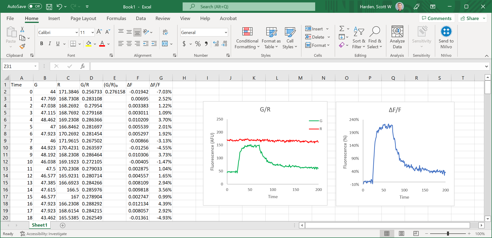
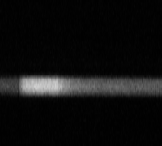

This page describes how to analyze fluorescence intensity (ΔF/F₀) from a ratiometric linescan using [ImageJ (Fiji)](https://fiji.sc/) and Excel. While semi-automated custom tools are often used to facilitate rapid analysis of fluorescence data, there is great value in understanding how to realize these analyses using standard and commonly-available software.

## Measure Fluorescence with ImageJ
* Rotate images so time proceeds horizontally from left to right.
  * If original data is vertical (time proceeds top to bottom), `Image` > `Transform` > `Rotate 90 Degrees to Left`
* Merge `G` and `R` into a composite image
  * Click `Image` > `Color` > `Merge Channels`
  * I recommend making the red channel magenta rather than red
* Draw a ROI around the structure of interest in the composite image
* Click `Analyze` and select `Plot Profile`
* Click `Live` and notice the curve change as you change channels using the scrollbar in the composite image
* For each channel, click `Data`, select `Copy All Data`, and paste the result in Excel
* The first column (pixel number) should be replaced by times

> 💡 The amount of black space captured by the ROI only slightly affects the resulting ΔF/F because fluorescence intensity in each channel is summed before taking the ratio. Note that mean ROI intensity is just the sum divided by a fixed area. Summing fluorescence from extra blank space does not affect the result beyond contributions from noise and basal fluorescence.

## Calculate Ratiometric ΔF/F with Excel

Two-channel fluorescence experiments report ΔF/F as the change in one fluorophore relative to another. In this example we will use `G` to represent a calcium-sensitive fluorophore and report the change in its fluorescence relative to a calcium-insensitive fluorophore `R`. In this example `G/R` is measured for each ROI in every time point. The following steps are performed for each ROI.

In this case `F` represents `G/R` so `ΔF/F` is: `[Δ(G/R)]/(G/R)₀`

* Calculate `(G/R)₀` as the mean ratio of fluorescence intensity during the baseline region

* Calculate `Δ(G/R)` by subtracting `(G/R)₀` from every `(G/R)` value

* Calculate `ΔF/F` by dividing `Δ(G/R)` values by `(G/R)₀`

## Sample Data

This excel file: [linescan.xlsx](linescan.xlsx)

Images analyzed:

Green | Red
---|---
|

## Resources

* [ROI Analysis Pipeline](https://github.com/swharden/ROI-Analysis-Pipeline/) (GitHub) is a collection of software tools for analyzing fluorescence images

* [ScanAGator](https://github.com/swharden/ScanAGator) (GitHub) is a tool that facilitates analysis of ΔF/F from ratiometric linescan images

