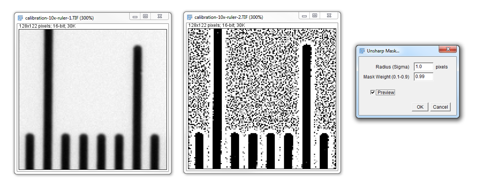
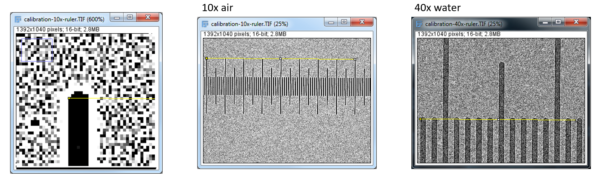
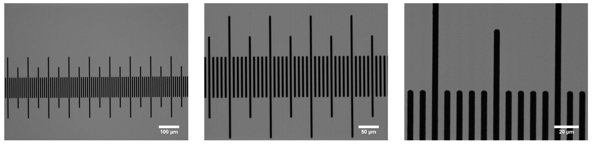
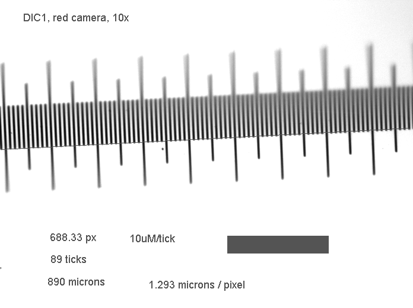
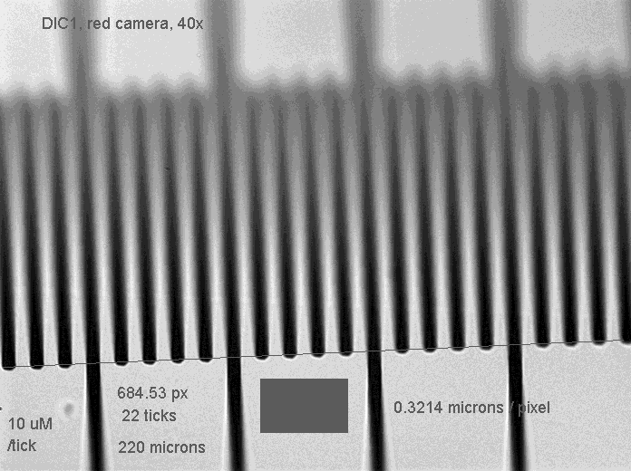

## Calibration Steps

* Use the calibration slide (called a _stage micrometer_, [$10 on Amazon](https://www.amazon.com/s?url=search-alias%3Daps&field-keywords=stage+micrometer))
  * Small ticks = 10 microns 
  * Medium ticks = 50 microns
  * Large ticks = 100 microns
* Take a picture of the ruler at every magnification
* In ImageJ apply 0.99 (maximum, aggressive) unsharp mark
* measure the distance (in pixels) between two ticks
  * use the farther two ticks you can
  * measure from the top left of each tick
* Example
  * 8 ticks (800 microns) span 1237.54 pixels
  * so 800 um / 1237.54 px = 0.64644 um/px
* Add scalebars to double-check your work (Analysis -> tools -> scale bar)


## Example Images

Apply an aggressive unsharp mask to maximally sharpen edges



Perform corner-to-corner measurement



Scalebars can be burned-in



### Example Calculations

10x|40x
---|---
|

## Scaling unscaled images

You could apply a known micron/px ratio using the mouse (Edit -> properties), or use the command:

```java
micronsPerPx=1.234;
run("Properties...", "unit=micron pixel_width=micronsPerPx pixel_height=micronsPerPx");
```
To burn a scale bar into an image, use this command:

```java
run("Scale Bar...", "width=100 height=20 font=40 color=Blue background=None location=[Lower Right] bold");
```

## Scales for My Microscopes

(µm/px) | 4x | 5x | 10x | 20x | 40x | 60x
---|---|---|---|---|---|---
**2P epi** | 1.6161 | | 0.64644 | 0.32365 | 0.10738 | .24139
**DIC red** | 3.2325 | | 1.293 |  | 0.3214 | 0.21439
**FL01** | 1.1240 |  | 0.4514 | 0.2254 |  | 
**Apo** |  | 1.2900 | 0.65216 | 0.32608 | 0.16304 | 0.102381
