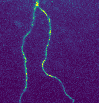

## Sample data

**Download:** [sample.tif](sample.tif)

Original | Stabilized
---|---
|

## 2D Image Stabilization

**TurboReg** is an ImageJ plugin for aligning images using a subpixel registration algorithm described by [Thévenaz et al., 1998](https://ieeexplore.ieee.org/document/650848). StackReg is an ImageJ plugin that applies TurboReg alignment to stacks. 

**Download:** [StackReg](http://bigwww.epfl.ch/thevenaz/stackreg/) (requires [TurboReg](http://bigwww.epfl.ch/thevenaz/turboreg/))

**Launch:** Plugins > StackReg

**Multichannel images** can be converted to RGB, stabilized, then converted back to multi-channel composite images.

## 3D Image Stabilization

3D image alignment is slower and more complex, so ensure it is truly needed for your application before proceeding.

* If your goal is to analyze projection images, I recommend projecting 3D times-series data to create a 2D stack then use StackReg to align it.

* If your goal is to perform analyses at distinct Z positions over time, 3D alignment is required.

**Correct 3D Drift** is an ImageJ plugin for 3D time-series alignment. It uses a phase correlation based algorithm described by [Preibisch et al., 2009](https://www.ncbi.nlm.nih.gov/pmc/articles/PMC2682522/). This plugin ships with FIJI and does not have to be manually installed.

**Download:** [Correct_3D_Drift](https://github.com/fiji/Correct_3D_Drift)

**Launch:** Plugins > Registration > Correct 3D Drift