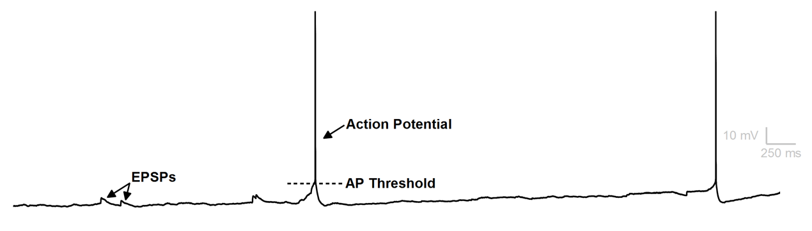
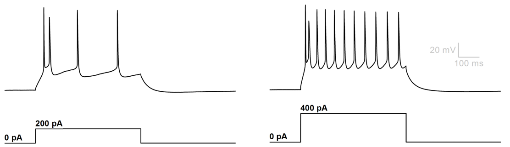

When the action potential threshold voltage is reached, an action potential ensues. Action potentials can occur spontaneously either because the neuron naturally rests above its threshold (in which case it fires continuously), or because excitatory synaptic inputs (EPSPs) raise its voltage above threshold.

<figure class="figure">
  
  <figcaption class="figure-caption">

**Action Potentials in Current-Clamp Configuration.** Sub-threshold EPSPs are visible in this example. When EPSPs are sufficiently large (or enough EPSPs occur simultaneously), the neuron is depolarized past action potential threshold and an action potential ensues.

  </figcaption>
</figure>

Action potentials can be incited by current delivered through the patch pipette. In this case, the current delivered is commonly displayed below the current-clamp recording trace.

<figure class="figure">
  
  <figcaption class="figure-caption">

**Excitatory current delivered through the recording pipette evokes action potentials.** One second pulses of excitatory current delivered through the recording pipette (bottom traces) depolarizes this neuron past its AP threshold and results in a continuous train of action potentials (top traces). The greater the excitatory current delivered, the faster the action potentials fire. The relationship between current injection and the resulting frequency of action potentials is commonly referred to as action potential gain.

  </figcaption>
</figure>
