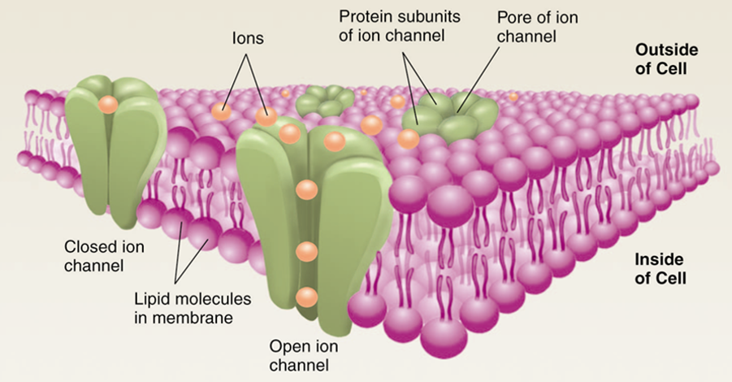

## Introduction

Neurons of high-order creatures interconnect to form complex networks which underlie thought, modulate behavior, and regulate every organ of the body to facilitate homeostasis. Although this large-scale network is extraordinarily complex, great insights can be achieved by studying it at the level of individual neurons. In a simplified view, neurons integrate inputs from surrounding neurons (in the form of excitatory and inhibitory electrochemical signals) and combine these inputs to determine their output (in the form of action potentials) to influence other neurons. Therefore, the pharmacological modulation of any of these steps (neurochemical excitation or inhibition, integration, action potential firing, or neurotransmitter release) at the level of the individual neuron may profoundly change the way the entire network operates. The discovery that a pharmacological agent participates in the neuromodulation of a pathway implicated in disease is an important first step toward the development of novel therapeutics.

## Whole-Cell Patch-Clamp Technique

A common method to study electrical properties of neurons in-vitro is to prepare acute brain slices from the brain of a living animal. When done properly, neurons in acute brain slices are so healthy they behave essentially the same as if they were inside the animal. When fine glass pipettes are filled with an electrically-conductive artificial cytoplasm, they can be used to puncture a neuron and allow it to rest in a physiological state while simultaneously recording its electrical signals. This artificial cytoplasm (called **pipette solution** or **internal solution**) contains molecules you would find inside a neuron (K+, Ca2+, Ca2+ buffer, ATP, and GTP). Experiments are performed in an **extracellular solution** consisting of oxygenated artificial cerebrospinal fluid (**ACSF**) containing ions you would expect in regular CSF (Cl-, Na+, buffering agents, and other ions). An easy way to remember what ions are inside the cell vs. outside is to recall that neurons evolved in the ocean, so salt water (Na+ and Cl-) are in the extracellular solution.

## Ion Channels and the Cell Membrane

What is actually being studied when a neuron is recorded? Since patch-clamp recordings are always made by comparing the electrical difference between intracellular vs. extracellular solutions, technically what gets measured is just the thing that separates the two: the **cell membrane**. When we say we characterize the electrical properties of a neuron, we are actually just reporting the properties of its membrane.

**Resistance** is the degree to which a material resists the flow of ions. Since cell membranes are largely made of phospholipid bilayers, **cell membranes have a high resistance**. This means they do not readily permit the passage of ions without the help of membrane-embedded proteins. Neural membranes contain large numbers if **ion channels**, which act like little holes in the membrane and permit the flow of particular ions in or out of the neuron, reducing the membrane resistance while the channels are open. The inverse of resistance is **conductance**, and the opening of ion channels in the neural membrane is said to decrease resistance and increase conductance. Depending on the charge and the direction of flow of ions moving through ion channels, the opening of ion channels could be excitatory or inhibitory to the neuron.

## Inward and Outward Currents

The flow of ions is called **current**, and the total amount of current flowing through all channels in the neural membrane is called **membrane current**. An **excitatory current** is one where positive ions rush into the cell (**inward current**), whereas an **inhibitory current** is one where positive ions rush out of the cell (**outward current**). These terms can also be used when describing the flow of negative ions if you consider the gain of a negative ion to be equivocal to the loss of a positive ion. In this way, inflow of negative ions (e.g., Cl-) is equivocal to the loss of positive ions, results in an outward current, and is inhibitory. It is important to gain conversational use of these terms since **electrophysiologists frequently describe currents as inward or outward** instead of using the terms excitatory and inhibitory.

## Cell Voltage

**Voltage** is a term that refers to the separation of charge between two points. In a battery, voltage is the difference in charge between the poles (about 1.5 V for a AAA battery). In a neuron, voltage is the difference in charge between the intracellular and extracellular solutions (about -70 mV for a typical neuron at rest). The way to change the voltage of a neuron is to apply excitatory or inhibitory current. A slight excitatory current applied to a neuron resting at -70 mV may raise its voltage to to -65 mV. If a strong enough excitatory current is applied, or many small excitatory currents are simultaneously applied, the excitation may be great enough to push the cell above its **action potential threshold** (often near -40 mV) and result in an **action potential** (AP). Action potentials are reviewed in greater detail in a later section.

> 💡 **Note:** The resting voltage of a neuron is typically shown as -70 mV but in practice can be from -90 mV to -30 mV. The primary reason neurons rest negative is because Na+/K+ pumps embedded in the neural membrane pump a large concentration of K+ into the cell, and perpetually-open potassium leak channels (KLEAK) allow it to flow out. The loss of a positive ion produces an outward (inhibitory) current, driving the cell toward negative voltages.

## Voltage vs. Current

**Why is voltage so often _not_ directly measured by electrophysiologists?** You may observe the majority of electrophysiology publications report important findings as changes in current rather than voltage. Voltage is very important to neural function, and it is the primary factor determining if a neuron will fire (whether its voltage crosses the action potential threshold). Although voltage is the important property, **membrane currents are what control the voltage of a neuron**. To study how a drug produces subtle shifts in the excitability of a neuron, it is often most desirable to study how that drug modulates membrane current (by acting on ion channels), rather than study the voltage swing that occurs as its downstream effect.

## Common Measurements and Units

- **Resistance** is measured in Ohms (Ω). We work with resistances in the megaohm (MΩ) to gigaohm (GΩ) range.

- **Voltage** is measured in Volts (V). Neurons operate in the millivolt (mV) range.

- **Current** is measured in amperes (A). We work with currents in the picoamp (pA) range.

- **Capacitance** is measured in Farads (F). We work with capacitances in the picofarad (pF) range.

> 🤓 **Nerd Alert:** Charge is measured in Coulombs (C). Current is the flow of charge, and 1A = 1C/sec. When the area under IPSCs or EPSCs is measured (amps _ sec), the units are Coulombs (or femtocoulombs, as pA _ ms = fC). A spontaneous current about 30 pA in amplitude produces approximately 250 fC of charge accumulation in the post-synaptic neuron. Conductance (the inverse of resistance, or I/V) is measured in Siemens (S). The typical conductance of a single ion channels is in the µS (microsiemens) range.
