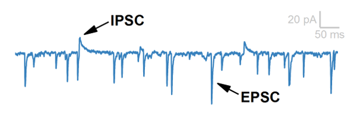
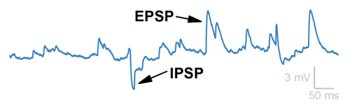

## Post-Synaptic Currents and Potentials

Consider what happens when an excitatory neurotransmitter released by another neuron activates a ligand-gated ion channel and allows positive ions to rush into the cell: the **inward current** produced is excitatory, and the **voltage** of the cell rises slightly. The result is a small excitatory **synaptic current**. In this example the **pre-synaptic** cell is the one that released the neurotransmitter, and the **post-synaptic** cell is the one that reacted to it. Since we virtually always record the post-synaptic cell, we virtually always describe **post-synaptic currents**.

> **Figure: Synaptic activity assessed in post-synaptic neurons.** Here a synapse is depicted. When the pre-synaptic neuron fires an action potential (AP), neurotransmitter is released from the axon terminal. In this example, the neurotransmitter is excitatory. When the neurotransmitter acts on the post-synaptic neuron (the neuron being recorded), the excitatory action of that synapse is observed as an excitatory post-synaptic current (EPSC). Note that this method exclusively measures EPSCs in the post-synaptic neuron, but can infer AP firing information about the pre-synaptic neuron.

Here we reach one of the most common sets of abbreviations in synaptic electrophysiology: **EPSC** (excitatory post-synaptic current) and **IPSC** (inhibitory post-synaptic current). If we describe the small voltage swing (a change in membrane potential) produced by these currents, we use the terms: **EPSP** (excitatory post-synaptic potential) and **IPSP** (inhibitory post-synaptic potential).

## Spontaneous vs. Evoked Synaptic Currents

One more layer of abbreviations can be added to note if the synaptic currents (or potentials) were spontaneous (due to the pre-synaptic neuron firing an action potential randomly) or evoked (by an electrical stimulator or optogenetic activation). Spontaneous synaptic events are abbreviated **sEPSC**, **sIPSC**, **sEPSP**, and **sIPSP**, and evoked synaptic currents are abbreviated **eEPSC**, **eIPSC**, **eEPSP**, **eIPSP**.

**What causes sEPSCs and sIPSCs?** Occasionally neurons fire spontaneously, releasing their neurotransmitter onto post-synaptic neurons. When recording post-synaptic neurons, the action of these neurotransmitters are visible as sEPSCs and sIPSCs. The most common source of EPSCs is **glutamate** binding to the **AMPA** receptor (a glutamate-gated Na+ channel which produces an excitatory inward current when open). The most common source of IPSCs is GABA binding to the GABA-A receptor (a GABA-gated Cl- channel which produces an inhibitory outward current when open).

Evoked synapses are discussed in a later section.

# Synaptic Currents in VC and IC Modes

Consider the following figure which demonstrates spontaneous excitatory and inhibitory synaptic activity in the same cell measured in voltage-clamp mode and current-clamp modes:

| voltage clamp                                        | current clamp                                        |
| ---------------------------------------------------- | ---------------------------------------------------- |
|  |  |

**In voltage-clamp configuration** net membrane current is displayed (note the vertical units). Spontaneous post-synaptic currents (EPSCs and IPSCs) are visible. IPSCs are upward deflections representing inhibitory (outward) currents. EPSCs are inward deflections representing excitatory (inward) currents. It is useful to simply commit to memory that “downward deflections in voltage-clamp configuration represent inward currents which are excitatory”.

**In current-clamp configuration** membrane voltage is displayed (note the vertical units). Spontaneous post-synaptic potentials (EPSPs and IPSPs) are visible. EPSPs are upward representing excitatory events, and IPSCs are downward representing inhibitory events. This is confusingly opposite in direction to the voltage-clamp trace but may be easier to remember if you consider that action potentials (excitatory events) are positive deflections of the current-clamp trace.

> 🤓 **Nerd Alert:** Voltage clamp traces are all upside-down. Consider excitatory synaptic inputs from the perspective of Ohm’s Law: a positive current is required to create a positive voltage. In other words, EPSCs are positive currents which create EPSPs. So why are EPSCs shown negative currents (downward deflections) in voltage-clamp traces? That’s because convention is to display current clamp data as the current the amplifier requires to hold the cell at the clamp voltage. Said differently, the voltage clamp trace is the current that the amplifier applies to the neuron to compensate for the current passing through the cell membrane. Voltage-clamp amplifier current is equal and opposite to membrane current. The inverse of the voltage-clamp trace is a pretty good representation of the net current flowing through ion channels of the neuron membrane. Although it would be nice if EPSCs and EPEPs were both shown as positive transients (displaying both from the perspective of the cell membrane and making it obvious they are both excitatory), convention is to display the inverted voltage-clamp trace, making EPSCs negative. For this reason, anything negative on a voltage-clamp trace is actually positive (excitatory) to the cell.
