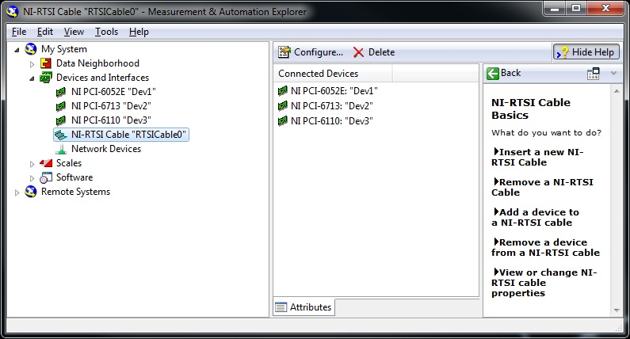



## Fixing nt-rtsi errors

Sometimes a Windows update will mess-up the NI device list. If PrairieView won't scan and has a "ni-rtsi" error, do this.

* open the "ni max" program ("NI-RTSI cable")
* open "devices and interfaces"
* right-click each device and delete any device that can be deleted
* ensure the cable is deleted too
* right-click to rename the 3 NI devices as follows:
  * NI PCI-6052E: "Dev1"
  * NI PCI-6713: "Dev2"
  * NI PCI-6110: "Dev3"
* right-click "devices and interfaces" and select "create new"
* add a "NI-RTSI Cable"
* right-click the newly made cable and add a device
* add each of the 3 devices
* ensure your configuration is identical to that shown here



## Update 2020-12-07
PrairieView would not image and gave error in DAQmxErrors.log
```
Status Code: -200478[12/07/2020 16:59:15] Device cannot be accessed.  

Possible causes:
Device is no longer present in the system.
Device is not powered.Device is powered, but was temporarily without power.
Device is damaged.

Ensure the device is properly connected and powered.  
Turn the computer off and on again.  
If you suspect that the device is damaged, contact National Instruments at ni.com/support.
Device Specified: Dev3
Suggested Device(s): Dev8

...and many similar errors
```

* This error was fixed by performing the sequence of events above.
* However, there is a new `NI PCI-6713`, probably for the uncaging laser.
* We identified the newer one as having a _lower_ device ID. We renamed that one to `Dev4`
