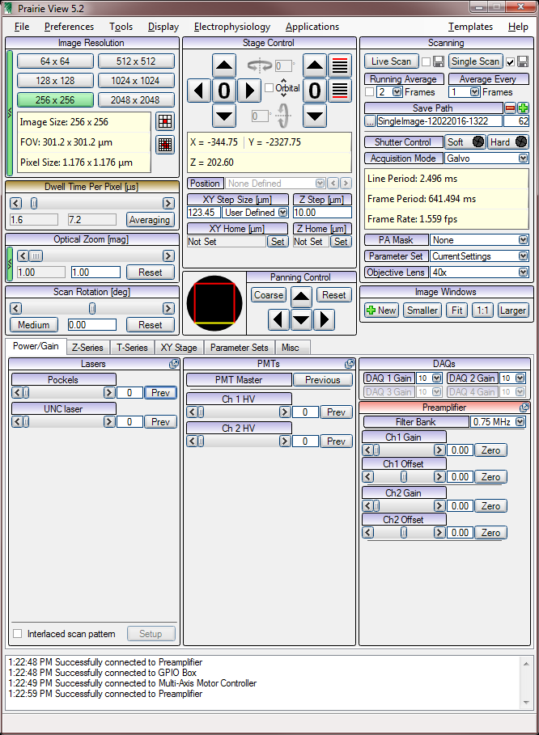
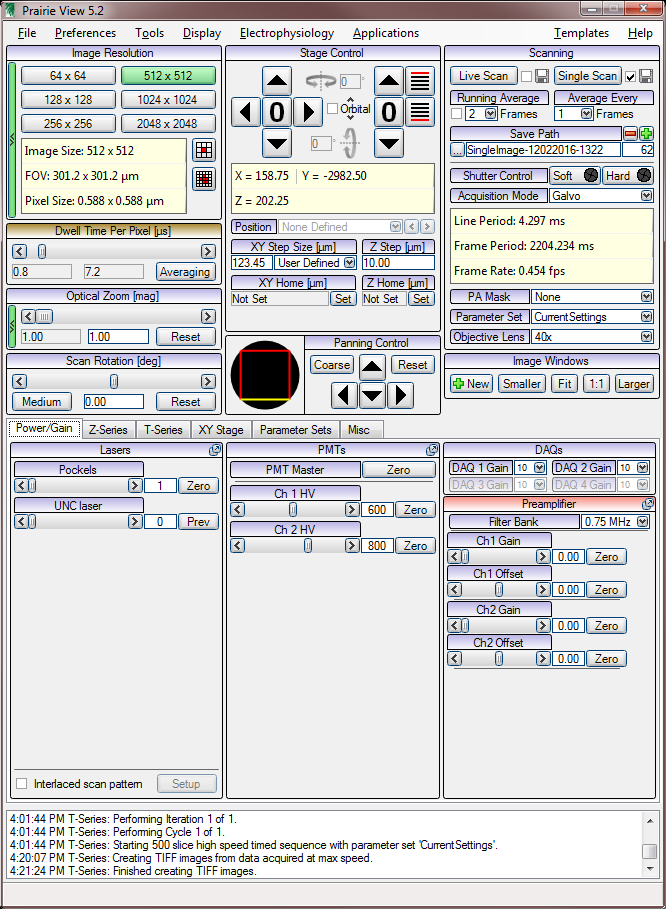
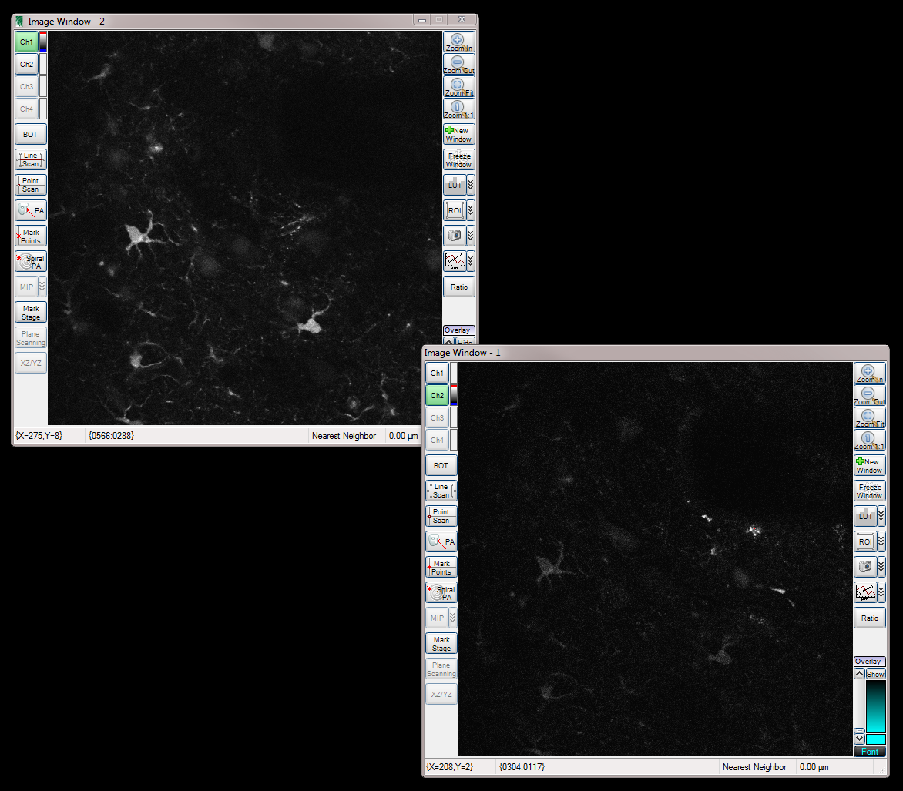
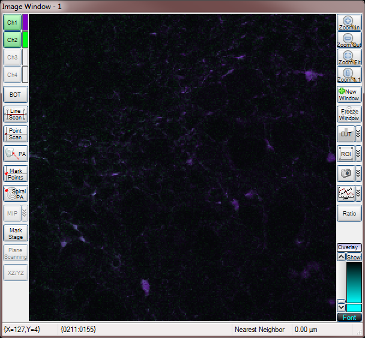



# 2P Startup Sequence

- **turn on power** to the 2P equipment (turn the switch on the ceiling ON)
- **turn on the cooler** (when it is OFF it shows _standby mode_, when it is ON it shows _coolant temperature_)
- **turn on the laser power supply** (twist the key to position _ON_)
- **open the laser shutter** (press the _shutter open_ button on the laser power supply so the light turns on)
- Laser current (the "amps" reading shown on the power supply) will increase as the laser warms up. After a few minutes it will stabalize, and "noise" will begin to appear on the oscilloscope. When both of these things occur, you are ready to proceed to the next step.
- **mode lock the laser** by temporarially switching the toggle switch from the _CW_ (continuous wave) position to the _ML_ position (mode lock) position. The oscilloscope display should change from "noise" to "clear peaks" indicating mode lock is successful. Move the toggle switch back to _CW_ position. Never leave it continuously in the _ML_ position!

# 2P Laser Power Adjustment

NOTE: our pockel cell controller is broken such that it can only be manually adjusted and not computer adjusted at this time. Although you should adjust laser power from with prarie software, currently you can only do so by adjusting voltage on the pockel controller power supply (beneath the keyboard)

- open prarie software (is this necessary?)
- **Calibrate power meter offset:** while looking at the power/energy meter, manually adjust pockel power knob to maximum extinction (where the needle shows the lowest value). The voltage should be about +40V. If the digital reading is not 0.00, adjust the _offset knob_ until it is. It doesn't have to be perfect, just close.
- range knob should be the lowest setting
- spectral filter should be OUT
- mode should be in mW
- **Set desired laser power:** Typically we want 1.50 mW. Set this by adjusting pockel voltage (turning the knob clockwise) until the power meter reads 1.50.
- This may drift over time as laser on time or room temperature changes, so you can continuously monitor this reading and adjust the knob as desired.
- To determine your optimal laser power, use the "live scan" mode and adjust power to maximize SNR and minimize photobleaching

# Sample Imaging

- place a brain slice in the chamber like normal``
- **prepare to image using DIC:**
- ensure _laser entry knob_ is rotated fully clockwise (NOT in the on position)
- select the DIC filter cube setting
- camera select bar should be fully pulled out
- shutter should be closed (unless you're doing epifluorescent imaging, in which case always close it after you use it)
- insert analyzer in light path
- insert polarizer in light path
- identify region of interest and focus on it using DIC and Qcapture with the water immersion 40x lens
- patch a cell and/or place the stimulator as desired
- **prepare to switch to 2P imaging mode:**
- ensure epifluorescence light is OFF
- ensure DIC IR light is OFF
- take analyzer out of the light path
- take polarizer out of the light path
- rotate filter cube block to the 2P position
- lower the curtain and ensure a good seal to prevent ambient light from getting in the cage
- reach one arm inside the cage and rotate _laser entry knob_ fully counter-clockwise
- **take some live two-photon images to focus on the region of interest:**
- you must set pockel value to 1 (this opens the hard shutter)
- **test the shutter:** by clicking the "hard" shutter control button to turn it on/off. Verify you hear the sound of the shutter moving, and see the blue light turning on and off. Leave this in the off position.
- the two switches on the shutter controller box Scott made (the metal one) should both be in the upward/on position.
- **STOP! Turn the lights off!** Keep them off until the PMT values are set to 0 again!
- set the following starting values (these will be adjusted as needed)
- Image Window: ensure CH1 and CH2 are enabled (colors set as desired)
- Image Resolution: 256x256
- Dwell Time: 7.2
- Optical Zoom: 1
- Scan Rotation: 0
- Running Average: 2
- Averave Every: 1
- hit _live scan_ and you should see stuff! Focus up and down with the stage controller. Adjust PMT as needed to change brightness.

# Done scanning / changing tissue

- ensure laser is off (scanning) and that soft and hard shutter are closed
- set PMT values to zero, glance at the PMT controller (top shelf) to be sure they are off (values of 0 or 1)
- you can now turn on lights in the room
- reach in the cage and close the _laser entro knob_ (twist it clockwise until it stops)
- go through the DIC setup sequence, see your cell at 40x, then go through the 2P setup sequence again

# 2P Shutdown Sequence

- ensure scanning has stopped and hard shutter and soft sutter are closed
- turn both PMT values to zero and verify their numbers go to 0 or 1 on the PMT controller
- set pockel value to zero
- close prarie software
- turn lights on in the room
- reach through and turn the _laser entry knob_ clockwise to close it, then open the curtain
- slide the filter cube selector to position 2 (DIC)
- pres the _open shutter_ button on the laser power supply to turn it OFF
- turn the key on the laser power supply to the OFF position
- place the cooling system into _standby mode_
- turn off the lightswitch near the ceiling

# Stage Stability Tips

- flow rate should always be 1mL/min or less.
- try to keep temperature as low as possible. The higher it is, the more the heater has to work to change the temperature of the incoming liquid. This creates hot/cold pockets and increases turbulance. Most significantly, rapid heating of cool water promotes dissolved gasses to become bubbles. **Slow formation of bubbles is one of the most significant problems** which causes poor 2P imaging over time (position drift) and patch pipette instability.
- use an inverted bubble trap (10mL syringe air pocket) to smooth the pulsation caused by the peristaltic pump

# screenshots

### Prarie View

### Live Imaging

### T series

### Z series

## Two Channels

## Merged Channels

## Range Check

