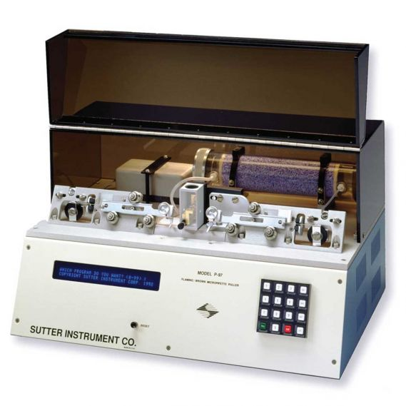

> ⚠️ **WARNING:** When pulling pipettes, it is EXTREMELY important to pay attention not to damage the filament inside the puller! Damaging the filament will prevent anyone in our laboratory from being able to pull pipettes or patch cells for up to several hours while a new puller is installed and calibrated. Therefore, if there is any uncertainty, do NOT proceed. Ask for help!

* Ensure the puller is on and in mode #3 (shown on the left side). If not, press the reset button.

* Lift the lid, and identify the right metal pipette holder. Ensure it is slid and locked all the way to the right. 

* Loosen the screw and slide a pipette in it (do NOT enter the center box yet), then tighten the screw just tight enough to prevent the pipette from moving. Ensure that the pipette is in the groove and level with the ground.

* Disengage the slide lock by pressing the shiny silver tab above each slider. Both sliders can move freely.

* Very gently slide the right slider toward the center. Visualize the pipette tip the whole time. It should enter the hole in the box, and slip in the middle of the filaments in the center of the box, and slide out the center of the hole in the left side of the box.

* While holding the right slider with the pipette in place, slide the left slider toward the center. The pipette will go in its groove.

* Using the tabs on the bottom of the sliding metal pipette holders with one hand, squeeze the two sliders together and perform the rest of the actions with your other hand.

* The goal is to center the pipette between the two sliding tabs. Loosen the right screw (the one holding the pipette) very slightly, perhaps by only a quarter of a turn. The pipette should not drift vertically because it will still be locked in the groove, but it should be able to slide left and right. Gently slide the pipette toward the left, until it is centered. Then tighten BOTH screws just tight enough to hold it (but not too tight to break the glass).

* When you let go, the sliders should remain in the center. Close the lid, and press PULL.

* Wait until a loud sound is generated and the pipette has been pulled. Then snap the left and right sldiers into their respective locked positions.

* Unscrew only one pipette, and use it as needed. Leave the other pipette for somebody else to use.

* Note that if a pipette is pulled poorly (with a broken tip or unexpected open tip diameter), it is likely the other half of the pipette is similarly poor, and should be discarded.
