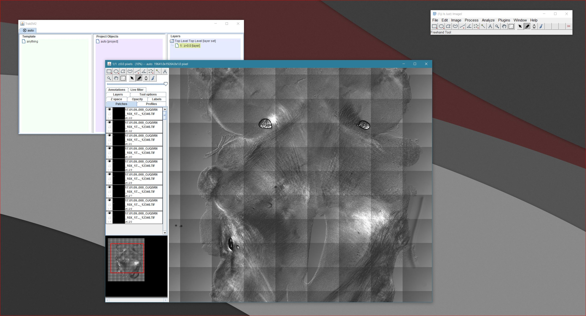
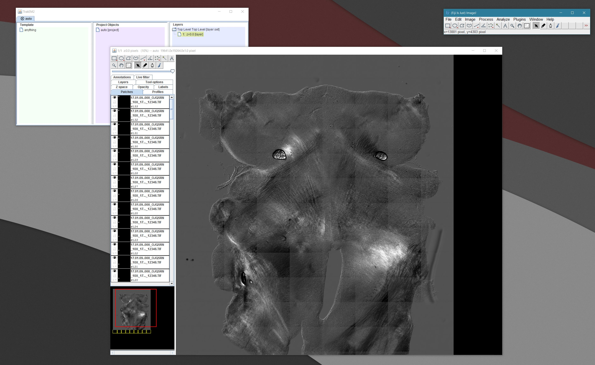
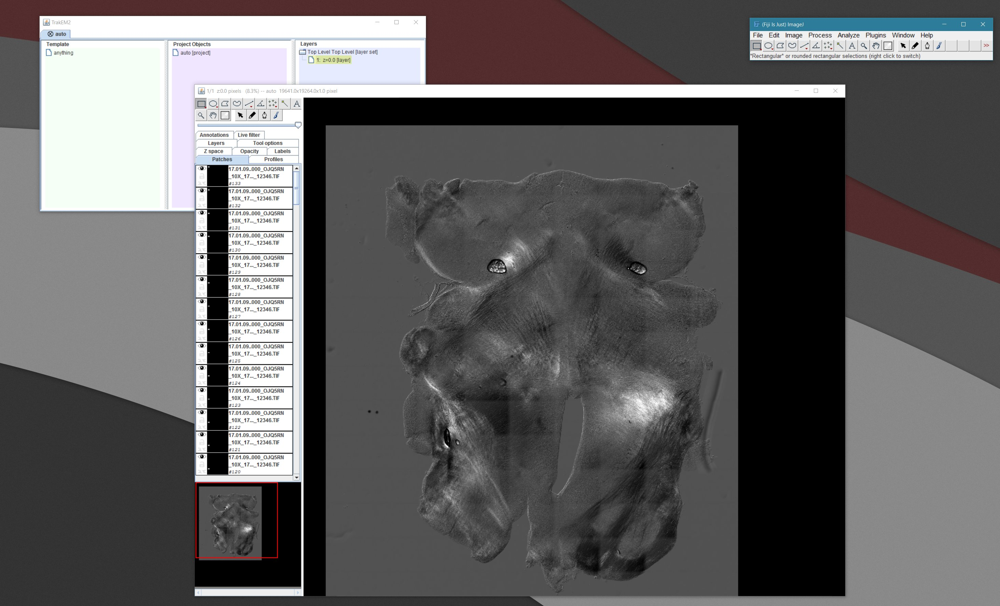



Stuff related to software to control the stage on the 2P microscope, acquire images, and recreate them as mosaics. Also covers deconvolution code.

* `SWHStage.py` seems to be the main thing I use currently. It saves XYZ coords in the filename. 

* `SWHstage_to_trackEM_xml.py` is how I turn it into an XML file ready to load into TrackEM (natively installed in FIJI).

## Steps

- run `SWHstage.py` on the 2p microscope and note where the images were saved. 1 montage series must be alone in a single folder.
- copy this folder from the X-drive to your local computer. Calling individual images from the X drive is too slow to proceed otherwise.
- run `SWHstage_to_trackEM_xml.py` on the folder that images were saved to locally. It will generate auto.xml in that folder
- drag/drop auto.xml onto ImageJ (FIJI) and TrackEM will launch.
- **right-click**, **adjust images**, **set min and max layer-wise** and go 0-4092 (I think?) or whatever looks good
- alternatively do layer-wise enhance contrast, do NOT normalize, and do click use full stack, 0.01% saturated pixels
- **right-click**, **align**, **all images in this layer**
- I like the phase correlation method
- **right-click**, **adjust images**, **blend layer-wise** (this will take a little while to run)
- export flat image (you can adjust scale here, I like 25%)

## Background Subtraction

- image an empty field (single frame)
- gaussian blur 50 px
- math subtract the minimum value in the frame
- analyze, set measurements, check min and max gray value
- analyze, measure (for me it shows 320)
- process, math, subtract (stack - background frame)
- file, save as, image sequence, slice labels as filenames
- process, image calculator (subtract original stack from new BG)

## Screenshots

### immediately on loading

### After subtracting DIC background

### After blending

## Source Code

- [swh-stitch.zip](swh-stitch.zip) - a small collection of Python files
