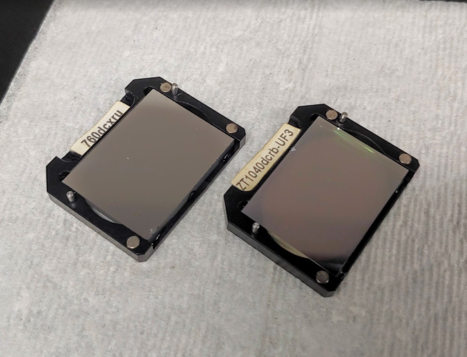
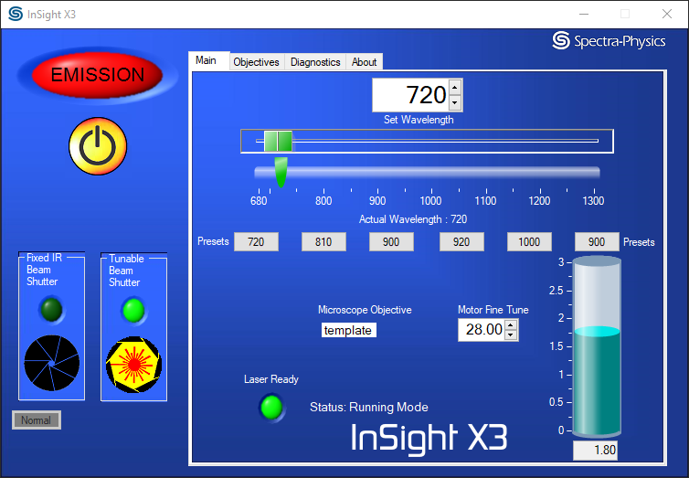
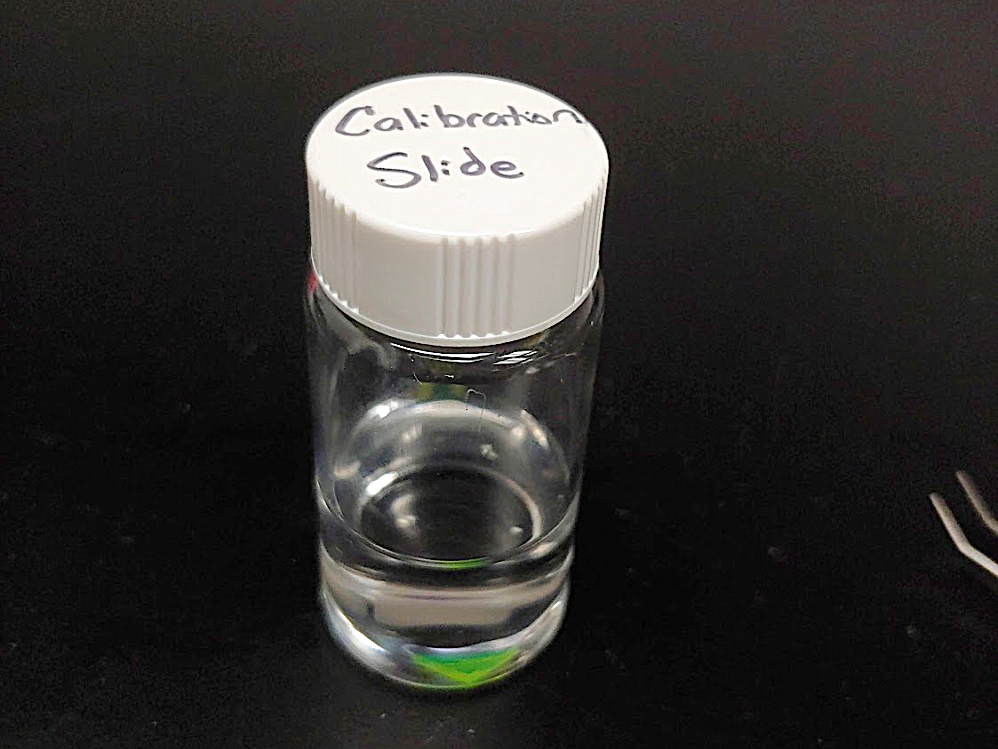
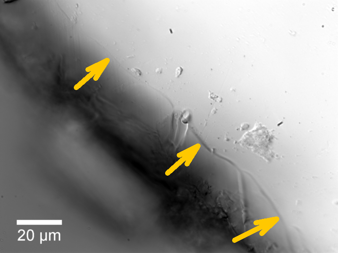
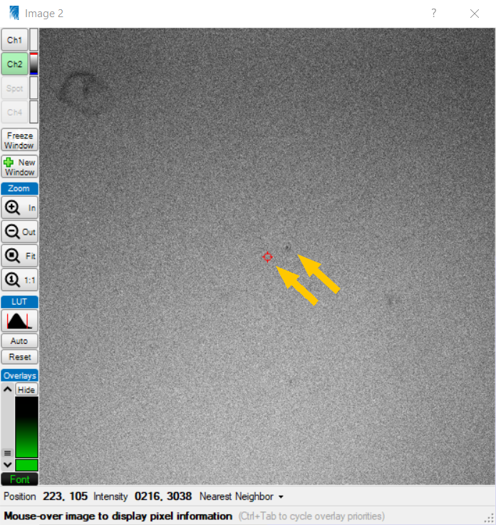
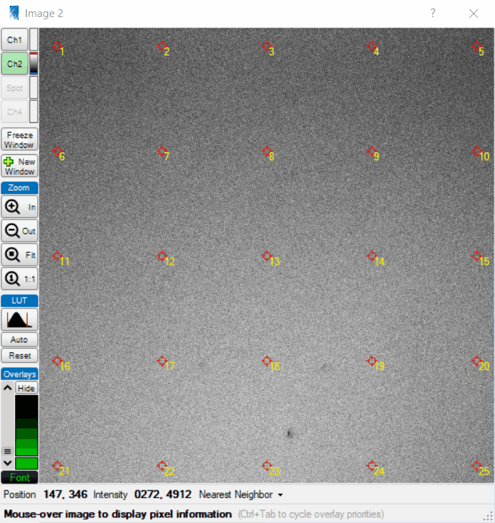
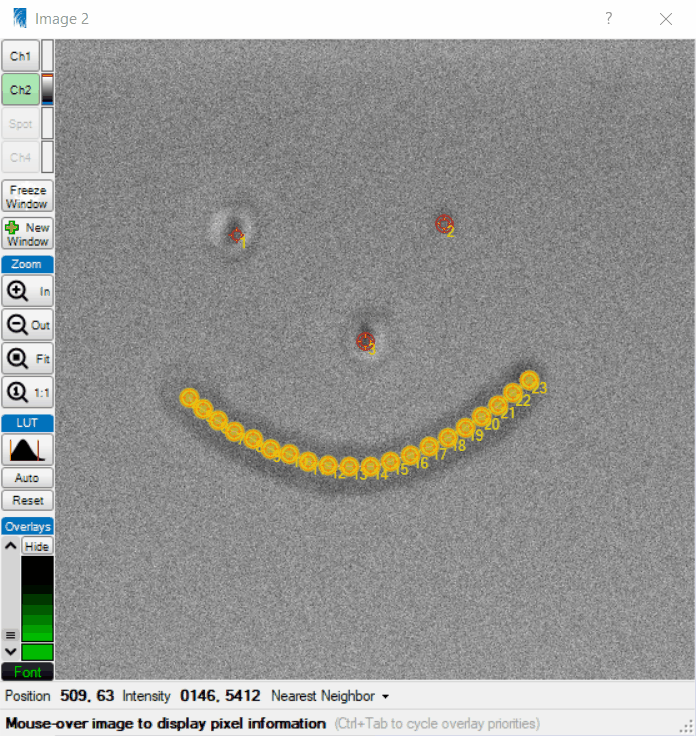
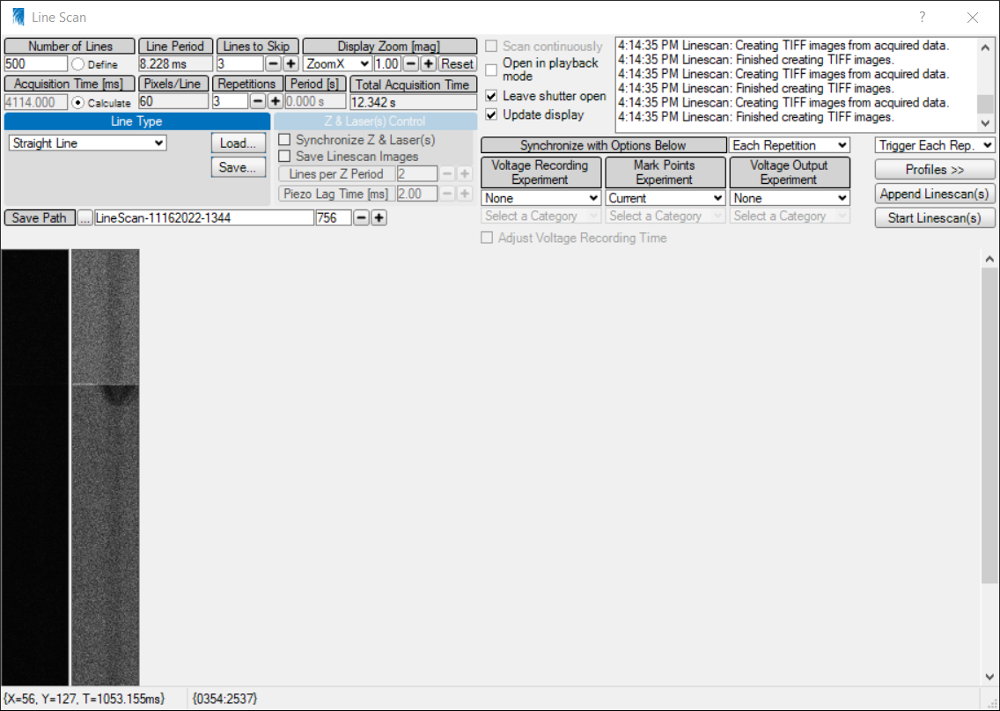
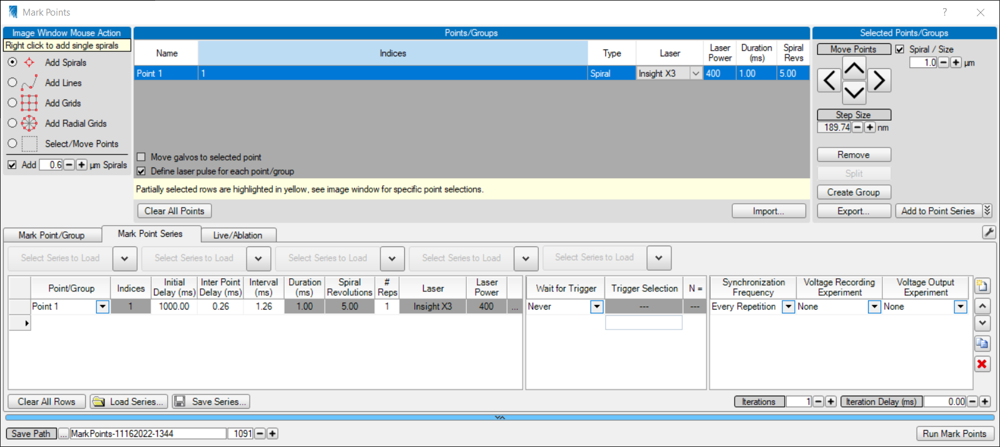
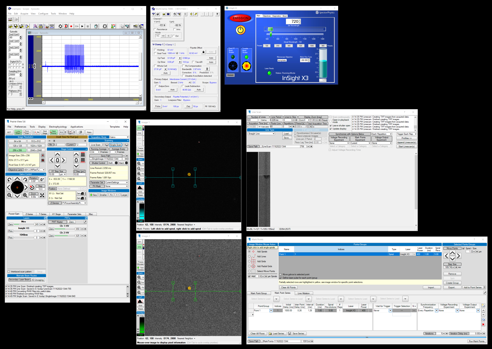



## Targeting Laser Filter

A filter must be manually changed in the headstage to control whether the tunable X3 laser is directed to the imaging system or laser targeting system. The filters have small magnets at the corners which allow them to snap in and out without using tools.

* **760dcxru:** Dichroic mirror that directs all X3 tunable laser light <760nm to the targeting galvos. This means the tunable X3 laser cannot be used for targeting >760nm. This configuration can be used for uncaging MNI-glutamate (720nm) but not activating ChR2 (920nm). If this filter is installed, the Mira laser is required for imaging.

* **ZT1040dcrb-UF3:** Notch filter that directs X3 tunable laser light (670–1300nm) to the imaging galvos. This should be installed whenever the tunable X3 laser is used for imaging. This should also be used for laser-targeted ChR2 activation using the X3 fixed 1045nm laser which is always directed to the targeting galvos.

Filters | Placement
---|---
|

## Alignment and Calibration

In order to take a picture using one laser and laser-uncage at a single point on that image using another laser, both lasers must be calibrated so their X/Y coordinates align as closely as possible. The calibration procedure described here aligns the Mira 810 nm imaging laser with the X3 tunable laser set to 720 nm for glutamate uncaging.

### Configure the Imaging System

* Install the appropriate beam splitter in the top of the headstage (pictured below)
* Use the Mira `810` nm laser at power `300` for imaging
* Use the X3 tunable laser set to `720` nm for uncaging
* The `Alternate Beam Routes` in PrairieView's Power/Gain tab should be set to `X3 Uncaging`
* PMT gain should be `650` (red) and `825` (green)
* Dwell time should be `7.2` µs
* Calibrate using the same lens and optical zoom you intend to use for experiments

### Load a Fluorescent Chip

Calibration is required between brain slices, and a fluorescent chip cut from a plastic fluorescent slide makes it possible to realign the lasers without disassembling the bath system. Store pieces in water so they sink when added to the stage.

Chip Storage | Chip Placement
---|---
|

* Use DIC optics to focus the microscope onto the surface of the fluorescent piece of plastic. 
* The surface of the plastic is virtually featureless, so start by finding the edge of the plastic then focus upward until you locate the surface, then translate the stage so the field of view is approximately center no the plastic.
* Once the surface of the plastic is in focus, switch to two-photon imaging, and adjust the Z position to locate the surface (the sharp transition from full-field darkness to full-field fluorescence)

The edge of the slide looks like a cliff. The top of the slide is found by identifying the sharp edge at the corner, and typically small amounts of debris resting on the sufrace can be focused on

### Align Lasers by Burning Spots

* **Launch the Uncaging Galvo Calibration tool:** In PrairieView click `Tools`, `Calibration/Alignment`, `Uncaging Galvo Calibration`
* **Select Type of Calibration:** Select `Burn Spots` and click Next
* **Select Calibration File:** We don't use calibration files, we just calibrate whatever optical zoom and scanning mode is currently enabled, so select `Current` and click Next. 
* **Use Current Calibration?:** Select `Yes` and click Next
* **Calibrate Center:** Press `Single Scan` to acquire an image of the fluorescent plastic before it has been perturbed by the uncaging laser. Click `Update` to burn a hole near the center of the field (and automatically acquire a new single scan).
  * **If you see the spot:** move the red crosshair to its center and click Next
  * **If you do not see a spot:** First verify your lasers are on, shutter is open, proper dichroic is in the headstage, and proper beam path selected in PrairieView. Then increase exposure duration or laser power. Note that lower magnification may require more duration to produce a larger hole.
  **If the spot is too big:** Reduce laser exposure duration. Note that a good hole size for a low zoom setting may be too large for a high zoom setting.
* **Calibrate X and Y:** Repeat the process for the next two screens
* **Calibrate Grid:** On the final screen pressing `Update` should burn spots that align nicely with the markers already on the screen. Although the grid markers can be adjusted, this is rarely necessary. Ideal experiments involve uncaging near the center of the field of view where the calibration is most ideal.

#### Burned Spot Alignment

burned spot | crosshair alignment
---|---
|

#### Grid Laser Targeting

## Create a Laser Targeting Protocol

To setup an uncaging experiment, expand the `Mark Points` window. Add points, lines, etc. to the top section of the window by selecting the appropriate radio button then clicking on the fluorescent image where you wish to uncage. Using the `MarkPointsSeries` tab and the `Add to Point Series` button, add just the points you wish to stimulate. Clicking `Run Mark Points` will then proceed with execution of this series.

* The `Initial Delay (ms)` describes how much time to wait before starting the point and lazing the point. Many imaging experiments desire a short baseline before uncaging, so a `1000` ms value here often makes sense.

* The `#Reps` column is typically `1`, but ABFs with multiple sweeps and/or linescans with multiple frames may require this number to be increased. In this case, a trigger or synchronization setting must be configured to ensure each repetitions occurs at the desired time.

MarkPoints Dialog Window | Burning Spots
---|---
|

## ABF-Triggered Linescan with Uncaging

To perform a linescan where laser uncaging occurs at a given time during the scan, open both the `LineScan` window and `MarkPoints` window.

### Linescan Acquisition Settings
  * Repetitions: 3
  * Trigger: Each Repetition
  * Synchronize: Each Repetition
  * Synchronize with: Mark Points Experiment (current)

### Mark Points Acquisition Settings
  * Initial Delay: 1000 ms
  * Reps: 1 (even if using multiple linescans)
  * Iterations: 1
  * Wait for trigger: Never
  * Synchronization Frequency: Every Repetition

### ABF Protocol Settings
  * Scans are initiated on by the rising edge of the trigger line
  * An ABF with 3 sweeps is ideal for a linescan/markpoints with 3 repetition

