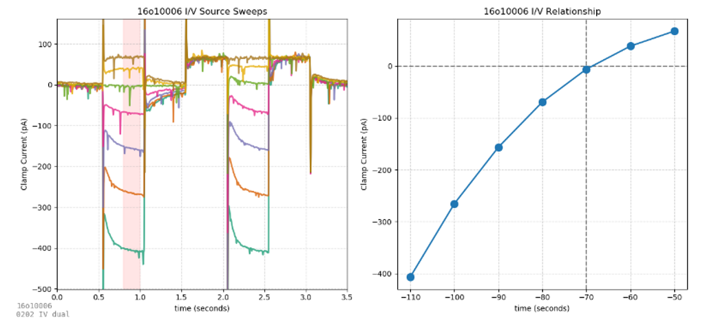
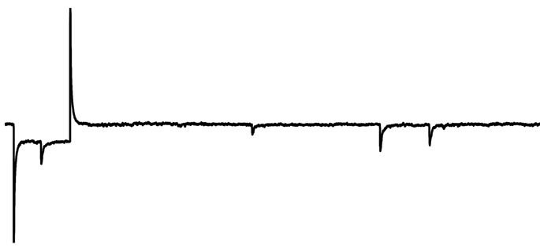
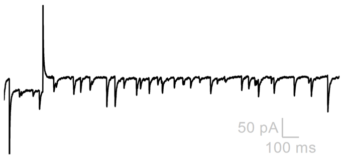
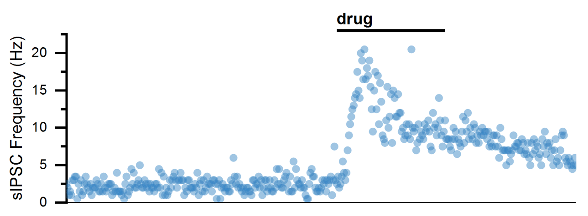

Although cellular neurophysiology literature is vast and complex, you will find that most experiments performed typically fall into one of a finite number of categories. Cells are often identified and categorized by inspecting their passive membrane and action potential firing properties, then drugs are often applied to see how passive properties, firing properties, or synaptic currents (spontaneous, electrically-evoked, or optogenetically evoked) change. This section describes examples of each of these types of experiments. A strong understanding of these basic experiments will leave you prepared to understand and critically evaluate much scientific literature.

We often use the term **protocol** to describe the set of instructions a patch-clamp amplifier uses to control the voltage (in VC mode) or current applied (in IC mode) to the cell. In our laboratory, protocols are given numbers (e.g., the membrane test protocol is 0201) to aid in organization. These numbers are referenced in some images.

## Membrane Test

The membrane test protocol is a 40 sweep voltage-clamp protocol which rapidly steps between two voltages. From this protocol, many passive membrane properties can be determined: steady state current (Is), membrane resistance (Rm), access resistance (Ra), and capacitance (Cm).

## Repeated Membrane Test

One of the most common experiments records a membrane test repeatedly as a drug is applied, and passive properties (Ih, Rm, Ra, and Cm) are continuously assessed. What each of these features mean is described in the previous chapter on membrane tests.
Many advanced experiments (studying spontaneous sIPSC/sEPSCs, I/V ramps, evoked synaptic currents, etc.) include a voltage clamp step at the start of every sweep. A membrane test analysis similar to the one displayed here can be performed on any voltage-clamp sweep with a square pulse voltage step in it, so you will find most voltage-clamp experiments contain this voltage step at the beginning of every sweep.

## I/V Curves

These protocols use fast voltage steps (0202) and slower voltage ramps (0203) to investigate current/voltage relationships in neurons. The voltage step protocol is best for revealing fast voltage-dependent current transients (e.g., visualizing an excitatory current due to a hyperpolarization-activated channel). While the purpose of voltage steps is to maximize transient currents, the purpose of voltage ramps is the opposite – minimizing transients to produce the smoothest sweeps ideal for averaging to create an I/V plot.

## AP Ramp

There are many properties of action potentials which can be investigated. One of the purest ways to isolate an action potential is to evoke it carefully from a current-clamp ramp. While current-clamp steps evoke trains of action potentials, the first action potential of the train is often distorted by the artifact of the current injection step, while the shapes of subsequent action potentials are influenced by the properties of the first. When a slowly-increasing current-clamp ramp is used to incite action potentials, the first action potential elicited is often most representative of the cell.

Commonly reported AP properties include:

- **Threshold (mV)** – the voltage at which the AP starts (usually defined as the point where its first derivative surpasses a defined upward velocity).

- **Rheobase (pA)** – the current required to incite an AP. This is the current at the time the threshold is crossed.

- **Repolarization velocity (mV/ms)** – the fastest rate at which the cell repolarizes after an action potential. Large numbers (fast repolarization) are indicative of fast-spiking interneurons.

- **Half-width (ms)** – the width of the AP (in time units). Since APs are triangular shaped (wider at the base than the top), this width is measured half-way between the base of the AP and its peak (hence the term half-width).

## AP Step

We saw earlier that injection of excitatory current through the patch pipette can produce action potentials. The plot where AP frequency is plotted against the current applied is called an AP gain curve and can be used to distinguish different classes of neurons.

## Spontaneous Synaptic Currents

Spontaneous excitatory and inhibitory synaptic currents can be visualized in voltage-clamp confirmation as sEPSCs and sIPSCs. Analysis is best performed when only one current is **isolated**, either by clamping at the reversal of other currents or by blocking other currents pharmacologically. When currents are isolated, they can be individually detected based on parameters (like their amplitude). The **parametric event detection** of spontaneous events can be used to quantify how drugs influence their frequency (usually an indication that a drug acts to change AP frequency of pre-synaptic neuron) or amplitude (usually an indication that a drug acts to change post-synaptic membrane resistance).

Baseline (basal sEPSC Frequency)

Drug (increased sEPSC Frequency)

Analysis (sEPSC Frequency over time)

